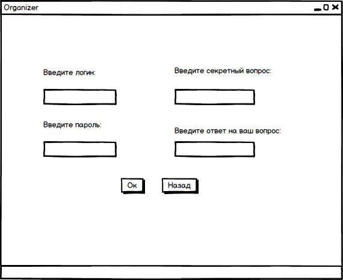
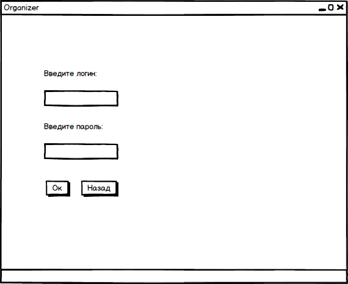
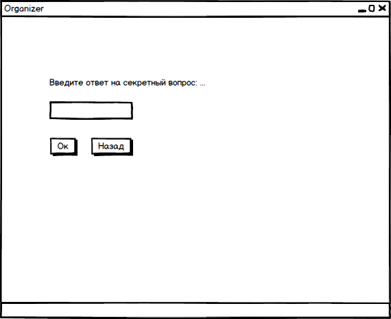
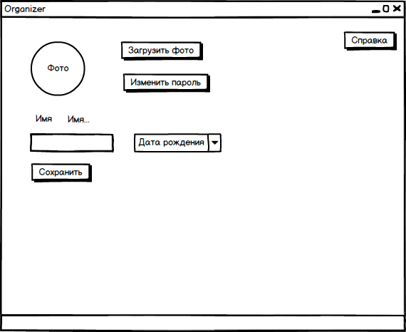

# Требования к проекту
---

# Содержание
1. [Введение](#intro)  
1.1 [Назначение](#appointment)  
1.2 [Бизнес-требования](#business_requirements)  
1.2.1 [Исходные данные](#initial_data)  
1.2.2 [Возможности бизнеса](#business_opportunities)  
1.2.3 [Границы проекта](#project_boundary)  
2. [Требования пользователя](#user_requirements)  
2.1 [Программные интерфейсы](#software_interfaces)  
2.2 [Интерфейс пользователя](#user_interface)  
2.3 [Характеристики пользователей](#user_specifications)  
2.3.1 [Классы пользователей](#user_classes)  
2.3.2 [Аудитория приложения](#application_audience)  
2.3.2.1 [Целевая аудитория](#target_audience)  
2.3.2.1 [Побочная аудитория](#collateral_audience)  
2.4 [Предположения и зависимости](#assumptions_and_dependencies)  
3. [Системные требования](#system_requirements)  
3.1 [Функциональные требования](#functional_requirements)  
3.1.1 [Основные функции](#main_functions)  
3.1.1.1 [Вход пользователя в приложение](#user_login_to_the_application)  
3.1.1.2 [Настройка профиля активного пользователя](#setting_up_the_profile_of_the_active_user)  
3.1.1.3 [Добавление записей](#add_notation)  
3.1.1.4 [Выход пользователя из учётной записи](#active_user_change)   
3.1.2 [Ограничения и исключения](#restrictions_and_exclusions)  
3.2 [Нефункциональные требования](#non-functional_requirements)  
3.2.1 [Атрибуты качества](#quality_attributes)  
3.2.1.1 [Требования к удобству использования](#requirements_for_ease_of_use)  
3.2.1.2 [Требования к безопасности](#security_requirements) 

# 1 Введение

## 1.1 Назначение
Десктопное приложение "Органайзер" предназначено для уменьшение нагрузки на память человека путём оставления заметок. Приложение поддерживает кроссплатформенность.

## 1.2 Бизнес-требования

### 1.2.1 Исходные данные
Современное поколение ежедневно получает огромное количество информации, обрабатывать которое мозг физически не успевает. Так как большинство пользователей смартфонов, ПК и др гаджетов, подключённых к интернету, постоянно получают информацию из социальных сетей, сайтов и др электронных источников. Такая информация состоит из нужной и бесполезной, и мозг человека запоминает только часть из этой информации, оставляя много полезного за гранью памяти. Поэтому данное приложение может выполнять часть функций головного мозга, таких как "RAM".

### 1.2.2 Возможности бизнеса
Данное приложение будет пользоваться популярностью у современного человека, так как по исследованию учёных: нынешнее поколение может запоминать больше информации (вопреки всеобщему мнению), однако, информации стало гораздо больше и удержать её стало сложнее.

### 1.2.3 Границы проекта
Приложение позволит создавать, редактировать существующие и удалять неактуальные записи. Также возможно восстановление уже прошедших событий за счёт хранения истории в базе данных.

# 2 Требования пользователя

## 2.1 Программные интерфейсы
Приложение использует базу данных MySQL. В основе приложения - стандартные библиотеки Java. Для построения  GUI используется JavaFx.

## 2.2 Интерфейс пользователя
Окно входа в приложение.  
При нажатии на кнопку "Войти" - переход к окну входа в приложении.  
При нажатии на кнопку "Зарегистрироваться" - переход к окну регистрации нового пользователя.  
При нажатии на кнопку "Забыл пароль" - переход к окну восстановления пароля.  
  
Окно регистрации нового пользователя.  
При нажатии на кнопку "Ок" - переход к главному окну, если введены все поля.  
При нажатии на кнопку "Назад" - переход к окну входа в приложение.  
  
Окно входа уже зарегистрированного пользователя.  
При нажатии на кнопку "Ок" - переход к главному окну, если введены все поля.  
При нажатии на кнопку "Назад" - переход к окну входа в приложение.  
  
Окно восстановления пароля.  
При нажатии на кнопку "Ок" - переход к главному окну, если введены все поля.  
При нажатии на кнопку "Назад" - переход к окну входа в приложение.  
  
Главное окно приложения.  
При нажатии на кнопку "Добавить заметку" - если введены все поля, заметка добавляется в память приложения.  
При нажатии на кнопку "Удалить заметку" - удаление заметки, но сохранения истории.  
При нажатии на кнопку "Поиск" - показываются все найденные заметки, поиск которых производился по указанному слову.  
При нажатии на кнопку "Важная заметка" - выбранная заметка помечается особым свойством и добавляется в список важных заметок.  
При нажатии на кнопку "Настройки" - переход к окну настроек профиля пользователя.  
При нажатии на кнопку "Справка" - откытие справки приложения.  
  
Окно настройки профиля пользователя.  
При нажатии на кнопку "Справка" - откытие справки приложения.  
При нажатии на кнопку "Сохранить" - изменяется имя пользователя и дата рождения.  
При нажатии на кнопку "Загрузить" - выбор нового фото для профиля.  
При нажатии на кнопку "Изменить пароль" - переход к окну восстановления пароля.  

## 2.3 Характеристики пользователей

### 2.3.1 Классы пользователей

| Класс пользователей | Описание |
|:---|:---|
| Зарегистрированные пользователи | Пользователи, которые вошли в приложение под своим именем (псевдонимом), желающие просматривать списки своих записей. Имеют доступ к полному функционалу |

### 2.3.2 Аудитория приложения

#### 2.3.2.1 Целевая аудитория
Люди средней возрастной категории со средним или выше среднего уровнем образования, обладающие минимальной технической грамотностью.

#### 2.3.2.2 Побочная аудитория
Люди младшей и старшей возрастных категорий, обладающие минимальной технической грамотностью.

## 2.4 Предположения и зависимости

# 3 Системные требования

## 3.1 Функциональные требования

### 3.1.1 Основные функции

#### 3.1.1.1 Вход пользователя в приложение
**Описание.** Пользователь не имеет возможность использовать приложение без создания собственного профиля либо вхождения в свою учётную запись.

| Функция | Требования | 
|:---|:---|
| Регистрация нового пользователя | Приложение должно запросить у пользователя ввести имя и пароль для создания учётной записи. Пользователь должен либо ввести имя и пароль, либо отменить действие |
| Вход зарегистрированного пользователя в приложение | Приложение должно предоставить пользователю список имён (псевдонимов) зарегестрированных пользователей. Пользователь должен либо выбрать из списка своё имя (псевдоним), либо отменить действие. После этого необходимо ввести пароль пользователя |

#### 3.1.1.2 Настройка профиля активного пользователя
**Описание.** Зарегистрированный пользователь имеет возможность редактировать своё имя и пароль.
 
| Функция | Требования | 
|:---|:---|
| Изменение имени пользователя | Приложение должно запросить ввести новое имя а также пароль для подтверждения действия. Если выбранное имя уже существует, приложение предоставит возможность повторного ввода |
| Изменение пароля | Зарегистрированный пользователь имеет возможножность изменить пароль, при этом приложение запрашивает ввести старый пароль для подтверждения личности |
| Удаление учётной записи пользователя | Зарегистрированный пользователь имеет возможность удалить созданную учётную запись, для чего приложение запрашивает пароль |

#### 3.1.1.3 Добавление записей
**Описание.** После входа пользователя в приложение или после завершения радактирования профиля зарегистрированным пользователем возможно создание записей.

| Функция | Требования | 
|:---|:---|
| Создание записи | Приложение должно создать событие, предоставив пользователю бланк заполнения события, в котором указана дата события и описание |
| Редактирование записи | Приложение должно предоставить доступ к уже созданной записи, для её дополнения/изменения |
| Поиск записей | Приложение должно найти созданную запись по введённой ключевой фразе |
| Форматированный поиск | Приложение должно найти созданные записи по введённой ключевой фразе или дате (общей для нескольких записей) |

#### 3.1.1.4 Выход зарегистрированного пользователя из учётной записи
**Описание.** Зарегистрированный пользователь имеет возможность выйти из учётной записи.

**Требование.** Приложение должно предоставить зарегистрированному пользователю возможность выйти из учётной записи с возвратом к окну входа в приложение.

### 3.1.2 Ограничения и исключения
1. Отсутствует возможность пользоваться приложением, не имея учётной записи. 

## 3.2 Нефункциональные требования

### 3.2.1 Атрибуты качества

#### 3.2.1.1 Требования к удобству использования
1. Доступ к основным функциям приложения не более чем за две операции;
2. Все функциональные элементы пользовательского интерфейса имеют названия, описывающие действие, которое произойдет при выборе элемента;
3. Пошаговая инструкция использования основных функций приложения отображена в справке;
4. Неактуальные записи сохраняются в памяти приложения, что позволяет получить прямой доступ к ним.

#### 3.2.1.2 Требования к безопасности
Приложение предоставляет возможность просмотра и редактирования профиля только авторизированному пользователю.

